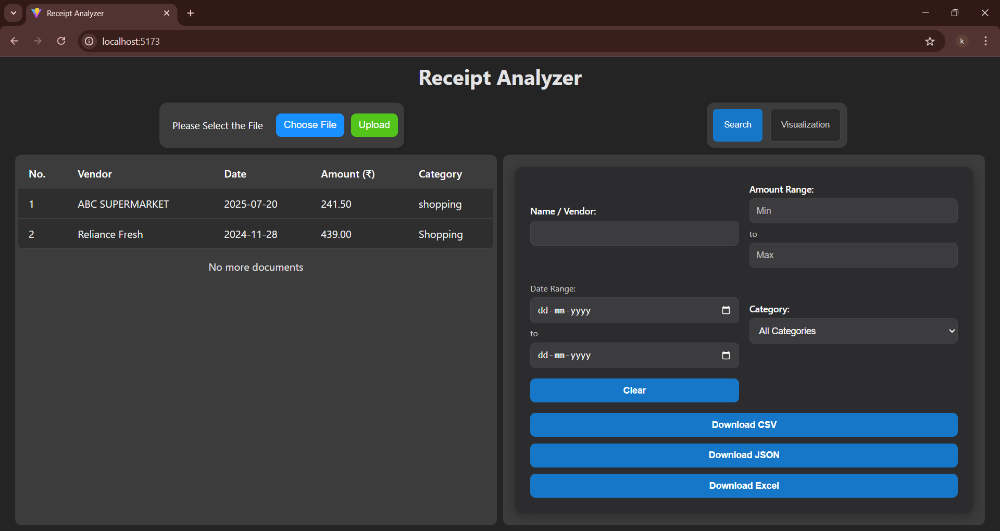
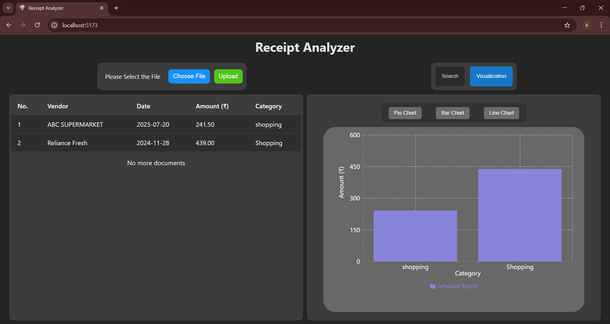
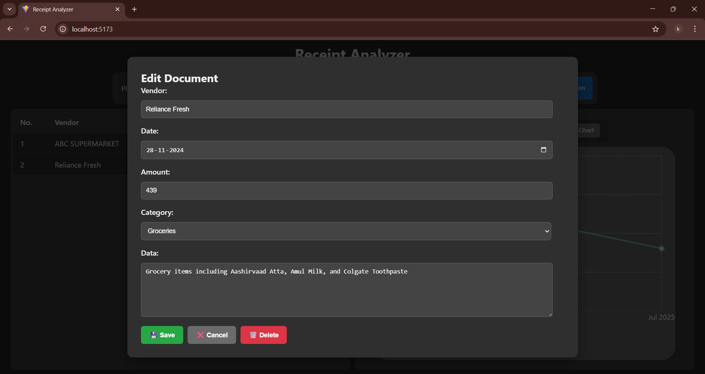
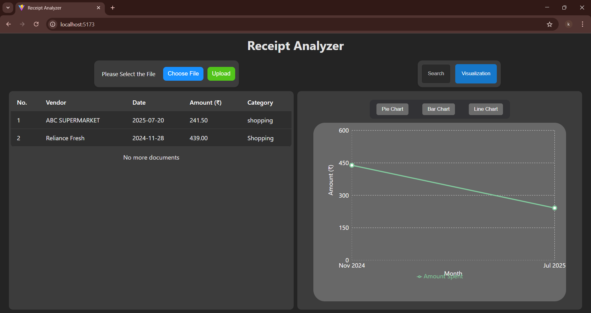
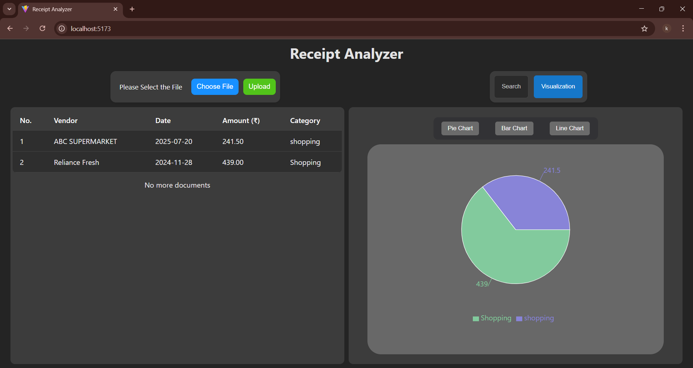

# Receipt - Analyzer (Search & Visualization Interface)

## Table of contents

- [Overview](#overview)
- [About my Implmentation](#about-rag-implementation)
- [Built with](#built-with)
- [Installation](#installation)
- [Output](#resultanalysis)
- [Features](#features)
- [Author](#author)


## Overview

 - An full-stack web application for uploading, extracting, analyzing, and managing receipts and bills. It uses OCR and LLM-powered parsing to extract details like vendor, amount, date, and category from images or PDFs. Includes powerful search, filtering, pagination, and statistical insights.


## Detailed Explanation of the Implementation
## 1. Frontend (ReactJS)

- **Upload Interface**: Upload `.pdf`, `.jpg`, `.png`, or `.txt` files.
- **Dynamic Filters**: Vendor/category/date filters.
- **Pagination & Search**: Search receipts dynamically and paginate through results.
- **Statistics View**: View category-wise or monthly expense summaries.

---

## 2. Backend (FastAPI)

### Routes

- `POST /upload`: Accepts file uploads, processes OCR + LLM extraction, and stores the data in SQLite.
- `GET /filter_documents`: Returns paginated and filtered results.
- `GET /documents`: Sends all the documents
- `GET /download`: Exports data as CSV/JSON.

### Middleware & Validation

- File size/type validation.
- Response and request data validated using **Pydantic**.

---

## 3. Extraction Module (`extraction.py`)

- Uses **EasyOCR** and **PyPDF2** to extract text from image/PDF files.
- Sends extracted text to **LangChain** + **Groq’s LLaMA3** using a structured prompt.
- Parses structured values:
  - `<vendor>`, `<amount>`, `<category>`, `<date>`, `<description>`

---

## 4. Database Module (`db.py`)

- Built using **SQLAlchemy ORM**
- Contains:
  - `insert()` – Insert extracted data
  - `get_document_by_id()` – Search records
  - `filter_documents()` – Apply filters
- Auto-creates tables and handles data persistence
  ---

## 🛠️ Built With

- [ReactJS](https://reactjs.org/) – Frontend library for building user interfaces.
- [FastAPI](https://fastapi.tiangolo.com/) – Modern Python web framework for backend APIs.
- [EasyOCR](https://github.com/JaidedAI/EasyOCR) – Optical Character Recognition for extracting text from images.
- [PyPDF2](https://pypi.org/project/PyPDF2/) – Library to read text from PDF files.
- [LangChain](https://www.langchain.com/) – Framework for LLM application development.
- [Groq API](https://console.groq.com/) – API for running fast LLM inference using LLaMA3.
- [Pydantic](https://docs.pydantic.dev/) – Data validation and parsing using Python type hints.
- [SQLAlchemy](https://www.sqlalchemy.org/) – SQL ORM for database modeling and operations.
- [SQLite](https://www.sqlite.org/index.html) – Lightweight relational database used for data storage.


## Installation

### Prerequirements
  - `python3.11`
  - `Poppler Setup (for PDF to Image conversion)`
### Poppler Setup for windows

1. Download and Extract
    - Download Poppler ZIP from Google Drive
    - Extract it to a location like: `C:\poppler`
2. Add Poppler to System PATH
    - Search for Environment Variables in Windows.
    - Edit the Path system variable.
    - Add: `C:\poppler\bin`
3. Click OK and close all dialogs.

### Installation steps
 1. Clone the repository
  ```
    git clone https://github.com/UVARAJAND/Receipt-Analyzer.git
  ```
 2. Provide the `groq_api_key` in `.env` file
 ```
    GROQ_API_KEY=YOUR-API-KEY-HERE
 ```
 3. open seperate terminal and run this command 
  ```
    cd Backend
    pip install -r requirements.txt
    python app.py
  ```
 4. Open another seperate terminal and run this command
  ```
    cd receipt-analyzer
    npm install
    npm run dev
  ```
 5. Open the Application in Your Browser
      Visit:
 ```
  http://localhost:5173
 ```

 ✅ You’re now ready to use the Receipt Analyzer app!

## Output








## 🌟 Features

### Receipt Analysis
- Supports `.pdf`, `.jpg`, `.png`, and `.txt` files.
- Uses **EasyOCR** and **PyPDF2** for accurate text extraction.
- Extracts key fields like:
  - `<vendor>`, `<amount>`, `<category>`, `<date>`, and `<description>`
- Uses **LangChain** + **Groq's LLaMA3** model for structured field parsing from unstructured OCR text.

---

### Dynamic Dashboard
- Category-wise and monthly summary of expenses.
- Displays total spend, category distributions, and trends over time.

---

### Fast & Filterable Search
- **Search** to quickly locate receipts by text content.
- **Dynamic filters**:
  - By **vendor**
  - By **category**
  - By **date**

---

### Paginated View (Scalable)
- `Pagination` implemented to handle **large volumes of receipts** without performance drop.
- Reduces memory usage by loading data page by page.
- Backend optimized with limit-offset SQL queries.

---

### Performance & Scalability
- **Async file upload and processing** to avoid blocking.
- **FastAPI backend** ensures high throughput and low latency.
- Text extraction falls back to OCR only if PDF text parsing fails, reducing unnecessary processing time.
- **LangChain-based LLM calls** are invoked only once per document.

---

### Robust Validation
- File type and size validation for secure uploads.
- Pydantic is used for input/output schema enforcement.
- Error handling is added for file processing, OCR, and LLM inference.

---

### Export & Download
- Easily export all data as **CSV**, **JSON** and **excel**.
- Useful for accounting, tax filing, or offline analysis.

---

### Modular Architecture
- Clearly separated modules:
  - `Extraction.py` → OCR and LLM logic
  - `db.py` → SQLAlchemy DB models and queries
  - `app.py` → FastAPI routes and API endpoints
  - `frontend` → ReactJS dashboard and upload UI

## Demo

[Watch Demo Video](https://drive.google.com/file/d/17ClpLxdtNyoYspBf9FMkDHKNVPI8UNxD/view?usp=drive_link)


## Author

- Uvarajan D - Contact Gmail [uvarajandev@gmail.com]()

